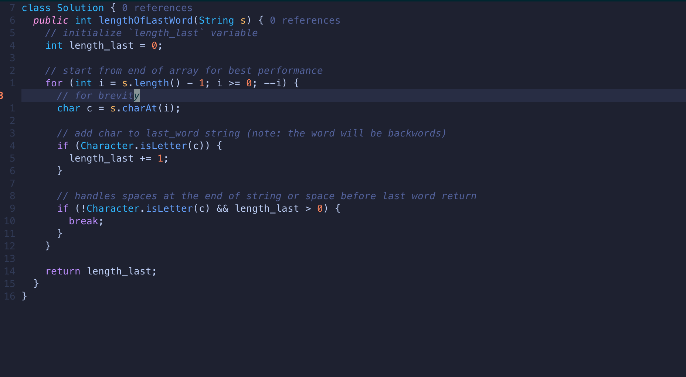
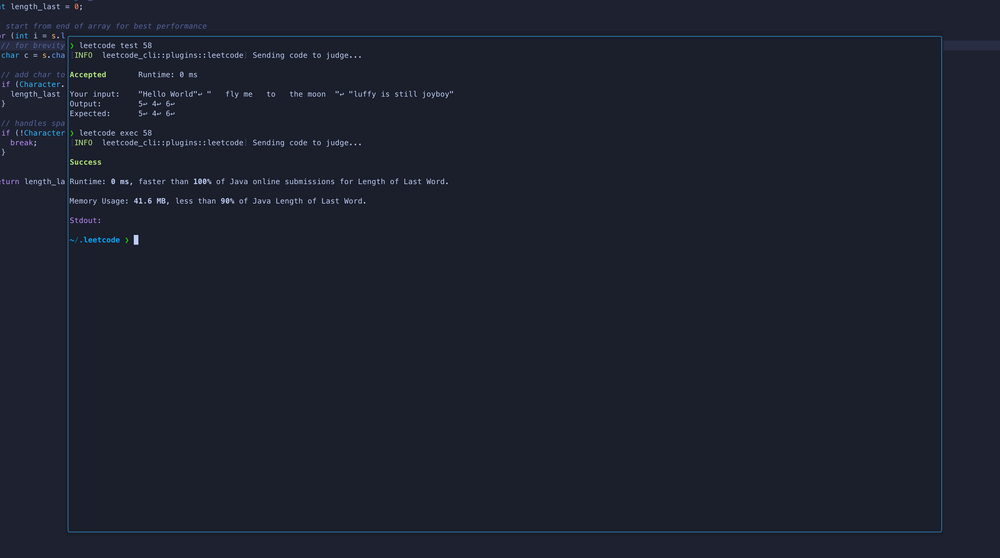

I recently came across some CLI tools for LeetCode. There are a few, but
here is [a link](https://github.com/clearloop/leetcode-cli) to the 
the one I've been using. These can be a useful tool in bringing 
LeetCode problems to your IDE. This gives a few advantages in the
Data Structures & Algorithms learning process, in my opinion. Some of them
being:

1. Gives the comfort of being in your personalized development environment
2. Allows for the use of version control and sharing your solutions (and notes) 
somewhere like GitHub.
3. Learning new programming languages while developing the tooling for the language to
develop locally e.g. linting, formatting, running tests, static type-checking, etc.

<!-- truncate -->

## Picking A Problem and Language Configuration

You can start off any problem before editing code by getting the problem statement
by running `leetcode pick <ID>`.

If this is a problem you wish then to solve, get the scaffolded problem LeetCode 
provides as a starting point by running `leetcode edit <ID>`.

If you've been solving problems in one language and get bored or want to begin learning
a new programming language toggle the `lang` variable in the `~/.leetcode/leetcode.toml`
file. That file looks something like this:

```toml
[code]
editor = "nvim"
lang = "java"

[cookies]
csrf = "CSRF_TOKEN HERE"
session = "LEETCODE_SESSION TOKEN GOES HERE"
site = "leetcode.com"

[storage]
cache = "Problems"
code = "code"
root = "~/.leetcode"
scripts = "scripts"
```

## Example (in Java)

For this example lets solve an easy one to see this flow in action.

I'll be using **Length of Last Word (58)** that falls in the category of 
_Arrays & Strings_. Here is a screenshot of my IDE in action



And then testing and executing that code in my floating terminal window reveals
the simple test cases run to acceptance and executing against the remote
problem grader shows statistics around time and space complexity of the submitted
solutions.



Happy learning!


